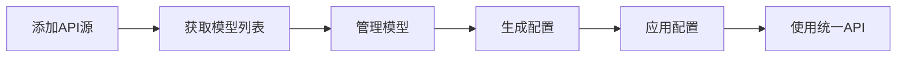

# uni-load-improved

<div align="center">


**整合型LLM大模型API网关系统**

[快速开始](#-快速开始) • [功能特性](#-功能特性) • [文档](#-文档) • [部署指南](#-部署指南)

</div>

---

## 📖 项目简介

uni-load-improved 是一个强大的LLM大模型API网关整合系统，旨在将分散在不同API网站的模型服务整合成统一、高效的负载均衡系统。通过Web界面轻松管理多个API提供商，自动生成负载均衡配置，实现模型的统一访问和智能调度。

### 🎯 核心优势

- **统一管理** - 一个界面管理所有API提供商和模型
- **智能负载** - 自动生成gpt-load配置，实现智能负载均衡
- **灵活配置** - 可自定义模型名称映射和删除不需要的模型
- **开箱即用** - Docker一键部署，5分钟完成配置
- **实时监控** - 健康检查和状态监控，确保服务稳定

### 🆚 与原uni-load的区别

| 特性 | uni-load-improved | 原uni-load |
|------|------------------|-----------|
| 模型重命名 | ✅ 可配置化 | ❌ 硬编码 |
| 模型删除 | ✅ 支持 | ❌ 不支持 |
| Web UI | ✅ 现代化界面 | ❌ 无 |
| Provider拆分 | ✅ 自动拆分 | ❌ 手动配置 |
| 配置生成 | ✅ 自动生成 | ❌ 手动编写 |
| 健康监控 | ✅ 实时监控 | ❌ 无 |

## ✨ 功能特性

### 核心功能

- 🔄 **API聚合服务** - 从多个API提供商获取模型列表，自动标准化模型名称
- 🎯 **模型管理** - 重命名、删除、分组管理模型，支持批量操作
- 🔀 **Provider自动拆分** - 同一Provider的多个模型自动拆分为独立Provider
- ⚙️ **配置自动生成** - 自动生成gpt-load和uni-api配置文件
- 📊 **健康监控** - 实时监控API提供商状态和响应时间
- 🌐 **Web UI管理** - 友好的Vue 3界面，支持所有管理操作
- 🐳 **容器化部署** - Docker一键部署，支持多架构
- 🔐 **安全加密** - API密钥加密存储，保护敏感信息

## 🚀 快速开始

### 前置要求

- Docker 20.10+ 和 Docker Compose 2.0+
- 至少2GB可用内存
- 至少5GB可用磁盘空间

### 使用Docker Compose（推荐）

```bash
# 1. 克隆项目
git clone https://github.com/your-org/uni-load-improved.git
cd uni-load-improved

# 2. 进入docker目录
cd docker

# 3. 复制并编辑环境变量配置
cp .env.docker.example .env
# 根据需要修改.env文件中的配置

# 4. 启动服务
docker-compose up -d

# 5. 查看服务状态
docker-compose ps

# 6. 查看日志
docker-compose logs -f
```

### 访问服务

- **Web UI**: http://localhost:8080
- **uni-api**: http://localhost:8000
- **gpt-load**: http://localhost:3001

### 快速验证

```bash
# 检查健康状态
curl http://localhost:8080/api/v1/health

# 预期响应
{
  "status": "healthy",
  "version": "1.0.0",
  "service": "uni-load-improved"
}
```

## 📚 文档

### 用户文档

- [用户指南](docs/USER_GUIDE.md) - 详细的使用说明和最佳实践
- [快速开始](DOCKER_QUICKSTART.md) - Docker快速部署指南
- [配置说明](docs/CONFIGURATION.md) - 完整的配置参数说明
- [FAQ常见问题](docs/FAQ.md) - 常见问题解答
- [使用示例](docs/EXAMPLES.md) - 实际使用场景示例

### 开发文档

- [开发指南](docs/DEVELOPMENT.md) - 开发环境搭建和开发规范
- [API文档](docs/API.md) - 完整的REST API接口文档
- [架构设计](docs/architecture-design.md) - 系统架构设计文档
  - [架构设计 Part 2](docs/architecture-design-part2.md)
  - [架构设计 Part 3](docs/architecture-design-part3.md)

### 运维文档

- [Docker部署](docker/README.md) - 详细的Docker部署文档
- [更新日志](CHANGELOG.md) - 版本更新记录
- [贡献指南](CONTRIBUTING.md) - 如何为项目做贡献

## 💡 使用指南

### 基本工作流程



### 1. 添加API源

在Web UI中点击"API源管理" → "添加API源"：

```yaml
名称: OpenAI Main
Base URL: https://api.openai.com/v1
API Key: sk-xxxxxxxxxxxxx
```

系统会自动：
- 测试连接可用性
- 获取模型列表
- 标准化模型名称

### 2. 管理模型

在"模型管理"页面：

- **查看模型** - 显示原始名称、标准化名称、自定义名称
- **重命名模型** - 统一不同Provider的模型名称
- **删除模型** - 移除不需要的模型
- **批量操作** - 支持批量重命名和删除

### 3. 生成配置

在"配置管理"页面：

1. 点击"生成配置"按钮
2. 系统自动生成：
   - gpt-load配置（负载均衡）
   - uni-api配置（统一网关）
3. 预览配置内容
4. 点击"应用配置"使配置生效

### 4. 使用统一API

配置完成后，通过uni-api访问所有模型：

```bash
# 使用统一的模型名称
curl http://localhost:8000/v1/chat/completions \
  -H "Content-Type: application/json" \
  -H "Authorization: Bearer YOUR_API_KEY" \
  -d '{
    "model": "gpt-4",
    "messages": [{"role": "user", "content": "Hello!"}]
  }'
```

系统会自动：
- 根据负载均衡策略选择Provider
- 转发请求到实际的API提供商
- 返回统一格式的响应

详细使用说明请参考 [用户指南](docs/USER_GUIDE.md)

## 🏗️ 系统架构

### 整体架构

```
┌─────────────────────────────────────────────────────────┐
│                      用户/应用                           │
└────────────────────┬────────────────────────────────────┘
                     │
         ┌───────────┴───────────┐
         │                       │
    ┌────▼─────┐          ┌─────▼──────┐
    │  Web UI  │          │  统一API   │
    │ (Vue 3)  │          │ (uni-api)  │
    └────┬─────┘          └─────┬──────┘
         │                      │
         │    ┌─────────────────┘
         │    │
    ┌────▼────▼──────────────────────────────────┐
    │      uni-load-improved (FastAPI)           │
    │  ┌──────────────────────────────────────┐  │
    │  │  • API聚合服务                       │  │
    │  │  • 模型管理服务                      │  │
    │  │  • Provider拆分服务                 │  │
    │  │  • 配置生成服务                      │  │
    │  │  • 健康监控服务                      │  │
    │  └──────────────────────────────────────┘  │
    └────────────────┬───────────────────────────┘
                     │
         ┌───────────┴───────────┐
         │                       │
    ┌────▼─────┐          ┌─────▼──────┐
    │ gpt-load │          │  SQLite    │
    │(负载均衡)│          │  (数据库)  │
    └────┬─────┘          └────────────┘
         │
    ┌────▼──────────────────────────────────┐
    │      外部API提供商                     │
    │  OpenAI • Azure • Claude • 其他...    │
    └───────────────────────────────────────┘
```

### 核心组件

- **Web UI** - Vue 3 + Element Plus，提供友好的管理界面
- **API Gateway** - FastAPI，处理所有HTTP请求
- **API聚合服务** - 从多个Provider获取和标准化模型列表
- **模型管理服务** - 处理模型的重命名、删除、分组
- **Provider拆分服务** - 自动拆分同Provider的多个模型
- **配置生成服务** - 生成gpt-load和uni-api配置
- **健康监控服务** - 定期检查Provider可用性
- **gpt-load** - 负载均衡和请求转发
- **uni-api** - 统一API网关

详细架构设计请参考 [架构设计文档](docs/architecture-design.md)

## 📁 项目结构

```
uni-load-improved/
├── backend/                    # 后端服务
│   ├── app/
│   │   ├── api/               # API路由
│   │   │   ├── api_sources.py # API源管理
│   │   │   ├── models.py      # 模型管理
│   │   │   ├── providers.py   # Provider管理
│   │   │   └── config.py      # 配置管理
│   │   ├── models/            # 数据模型
│   │   │   ├── api_source.py
│   │   │   ├── model.py
│   │   │   └── provider_model.py
│   │   ├── schemas/           # Pydantic schemas
│   │   ├── services/          # 业务逻辑
│   │   │   ├── api_aggregator.py    # API聚合
│   │   │   ├── model_manager.py     # 模型管理
│   │   │   ├── config_generator.py  # 配置生成
│   │   │   └── health_monitor.py    # 健康监控
│   │   ├── utils/             # 工具函数
│   │   ├── config.py          # 配置管理
│   │   ├── database.py        # 数据库连接
│   │   └── main.py            # 应用入口
│   ├── requirements.txt       # Python依赖
│   └── tests/                 # 测试代码
├── frontend/                   # 前端应用
│   ├── src/
│   │   ├── views/             # 页面视图
│   │   │   ├── Dashboard.vue
│   │   │   ├── ApiSources.vue
│   │   │   ├── ModelManagement.vue
│   │   │   └── Configuration.vue
│   │   ├── components/        # 通用组件
│   │   │   ├── Layout.vue
│   │   │   ├── ApiSourceForm.vue
│   │   │   ├── ModelRenameDialog.vue
│   │   │   ├── ProviderStatus.vue
│   │   │   └── ConfigPreview.vue
│   │   ├── api/               # API客户端
│   │   │   └── client.js
│   │   ├── router/            # 路由配置
│   │   ├── App.vue
│   │   └── main.js
│   ├── package.json
│   └── vite.config.js
├── docker/                     # Docker部署
│   ├── Dockerfile             # 主Dockerfile
│   ├── Dockerfile.backend     # 后端Dockerfile
│   ├── Dockerfile.frontend    # 前端Dockerfile
│   ├── docker-compose.yml     # Compose配置
│   ├── entrypoint.sh          # 启动脚本
│   ├── healthcheck.sh         # 健康检查
│   ├── supervisord.conf       # 进程管理
│   ├── nginx.conf             # Nginx配置
│   ├── build.sh               # 构建脚本
│   ├── deploy.sh              # 部署脚本
│   └── README.md              # Docker文档
├── config/                     # 配置文件
│   ├── config.example.yaml    # 配置示例
│   └── .gitkeep
├── data/                       # 数据目录
│   └── .gitkeep
├── docs/                       # 文档
│   ├── architecture-design.md
│   ├── architecture-design-part2.md
│   ├── architecture-design-part3.md
│   ├── USER_GUIDE.md          # 用户指南
│   ├── DEVELOPMENT.md         # 开发文档
│   ├── API.md                 # API文档
│   ├── CONFIGURATION.md       # 配置文档
│   ├── FAQ.md                 # 常见问题
│   ├── EXAMPLES.md            # 使用示例
│   └── README.md
├── scripts/                    # 脚本工具
│   ├── init_db.py             # 数据库初始化
│   └── migrate.py             # 数据迁移
├── .env.example               # 环境变量示例
├── .gitignore
├── LICENSE                    # MIT许可证
├── README.md                  # 项目说明
├── CHANGELOG.md               # 更新日志
├── CONTRIBUTING.md            # 贡献指南
└── DOCKER_QUICKSTART.md       # Docker快速开始
```

## 🔧 技术栈

### 后端技术

- **Python 3.11+** - 编程语言
- **FastAPI** - 现代化Web框架
- **SQLAlchemy** - ORM框架
- **SQLite** - 轻量级数据库
- **Pydantic** - 数据验证
- **httpx** - 异步HTTP客户端
- **APScheduler** - 任务调度

### 前端技术

- **Vue 3** - 渐进式JavaScript框架
- **Element Plus** - UI组件库
- **Vue Router** - 路由管理
- **Axios** - HTTP客户端
- **Vite** - 构建工具
- **js-yaml** - YAML解析

### 部署技术

- **Docker** - 容器化
- **Docker Compose** - 容器编排
- **Nginx** - Web服务器
- **Supervisor** - 进程管理

### 集成服务

- **gpt-load** - 负载均衡服务
- **uni-api** - 统一API网关

## 🚀 部署指南

### Docker部署（推荐）

详细部署文档请参考：
- [Docker快速开始](DOCKER_QUICKSTART.md)
- [Docker部署文档](docker/README.md)

### 手动部署

#### 后端部署

```bash
# 1. 安装Python依赖
cd backend
python -m venv venv
source venv/bin/activate  # Windows: venv\Scripts\activate
pip install -r requirements.txt

# 2. 配置环境变量
cp ../.env.example ../.env
# 编辑.env文件

# 3. 初始化数据库
python scripts/init_db.py

# 4. 启动服务
uvicorn app.main:app --host 0.0.0.0 --port 8080
```

#### 前端部署

```bash
# 1. 安装依赖
cd frontend
npm install

# 2. 构建生产版本
npm run build

# 3. 使用Nginx部署
# 将dist目录内容部署到Nginx
```

### 开发环境

```bash
# 后端开发
cd backend
python -m venv venv
source venv/bin/activate
pip install -r requirements.txt
uvicorn app.main:app --reload --port 8080

# 前端开发（新终端）
cd frontend
npm install
npm run dev
```

访问 http://localhost:5173 进行前端开发

## 🤝 贡献

我们欢迎所有形式的贡献！

### 如何贡献

1. **报告Bug** - 在 [Issues](https://github.com/your-org/uni-load-improved/issues) 中提交Bug报告
2. **提出功能** - 在 [Issues](https://github.com/your-org/uni-load-improved/issues) 中提出新功能建议
3. **提交代码** - Fork项目，创建分支，提交PR

### 贡献流程

```bash
# 1. Fork并克隆项目
git clone https://github.com/your-username/uni-load-improved.git
cd uni-load-improved

# 2. 创建特性分支
git checkout -b feature/amazing-feature

# 3. 进行开发和测试
# ... 编写代码 ...

# 4. 提交更改
git add .
git commit -m "Add amazing feature"

# 5. 推送到你的Fork
git push origin feature/amazing-feature

# 6. 创建Pull Request
```

详细贡献指南请参考 [CONTRIBUTING.md](CONTRIBUTING.md)

### 开发规范

- 遵循 [PEP 8](https://pep8.org/) Python代码规范
- 遵循 [Vue 3 风格指南](https://vuejs.org/style-guide/)
- 编写清晰的提交信息
- 添加必要的测试
- 更新相关文档

## 📊 项目状态


## 🗺️ 路线图

- [x] 基础功能实现
- [x] Web UI界面
- [x] Docker部署支持
- [x] 健康监控功能
- [ ] 配置历史和回滚
- [ ] 多用户支持
- [ ] 权限管理
- [ ] 统计分析功能
- [ ] 告警通知
- [ ] 插件系统

## 📝 许可证

本项目采用 MIT 许可证 - 详见 [LICENSE](LICENSE) 文件

## 🙏 致谢

感谢以下开源项目：

- [FastAPI](https://fastapi.tiangolo.com/) - 现代化的Python Web框架
- [Vue 3](https://vuejs.org/) - 渐进式JavaScript框架
- [Element Plus](https://element-plus.org/) - Vue 3组件库
- [gpt-load](https://github.com/your-org/gpt-load) - 负载均衡工具
- [uni-api](https://github.com/your-org/uni-api) - 统一API网关

## 📮 联系方式

- **项目主页**: https://github.com/your-org/uni-load-improved
- **问题反馈**: https://github.com/your-org/uni-load-improved/issues
- **文档站点**: https://docs.uni-load-improved.com

## ⭐ Star History

[](https://star-history.com/#your-org/uni-load-improved&Date)

---

<div align="center">

**如果这个项目对你有帮助，请给它一个 ⭐️**

Made with ❤️ by the uni-load-improved team

</div>