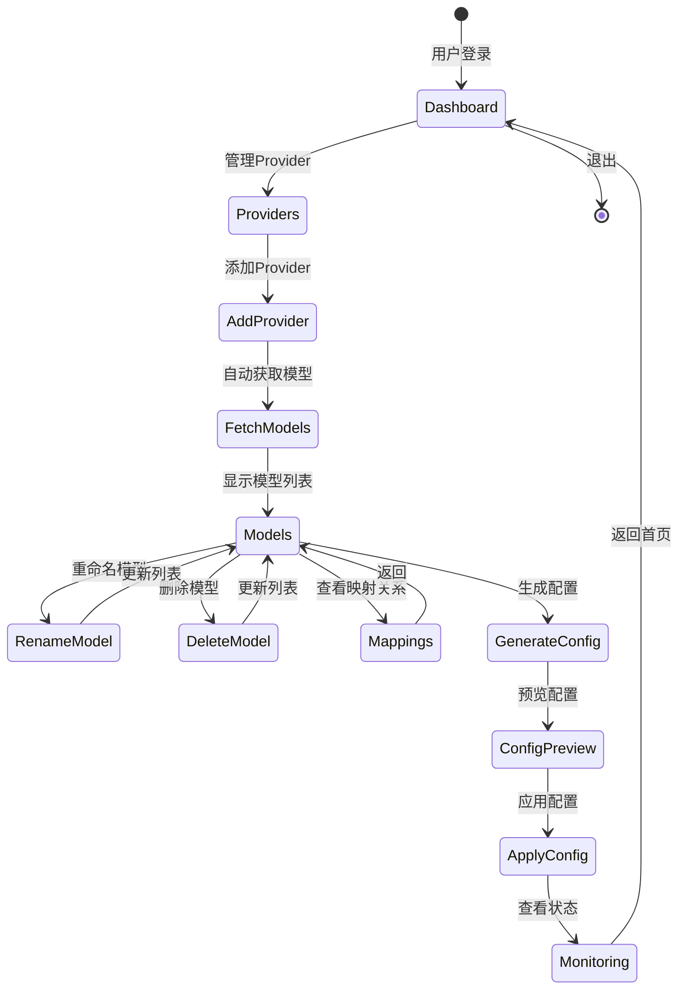

# uni-load-improved 架构设计文档（续）

## 3.4 前端界面模块（续）

#### 3.4.1 页面结构设计（续）

```
uni-load-improved-ui/
├── src/
│   ├── views/
│   │   ├── Dashboard.vue          # 仪表盘（概览）
│   │   ├── Providers.vue          # Provider管理
│   │   ├── Models.vue             # 模型管理
│   │   ├── Mappings.vue           # 模型映射管理
│   │   ├── Config.vue             # 配置生成和预览
│   │   └── Monitoring.vue         # 监控和日志
│   ├── components/
│   │   ├── ProviderForm.vue       # Provider表单
│   │   ├── ModelTable.vue         # 模型列表表格
│   │   ├── ModelRenameDialog.vue  # 模型重命名对话框
│   │   ├── ConfigPreview.vue      # 配置预览组件
│   │   └── HealthStatus.vue       # 健康状态组件
│   ├── stores/
│   │   ├── provider.ts            # Provider状态管理
│   │   ├── model.ts               # 模型状态管理
│   │   └── config.ts              # 配置状态管理
│   ├── api/
│   │   ├── provider.ts            # Provider API
│   │   ├── model.ts               # 模型API
│   │   └── config.ts              # 配置API
│   ├── types/
│   │   └── index.ts               # TypeScript类型定义
│   └── utils/
│       ├── request.ts             # HTTP请求封装
│       └── validators.ts          # 表单验证
├── App.vue
└── main.ts
```

#### 3.4.2 用户交互流程



#### 3.4.3 关键页面设计

**Dashboard页面**
- Provider数量统计
- 模型总数统计
- 活跃API数量
- 最近更新时间
- 快速操作入口

**Providers页面**
- Provider列表（表格）
- 添加/编辑/删除Provider
- 测试连接功能
- 批量导入功能
- 刷新模型列表

**Models页面**
- 模型列表（支持筛选、搜索）
- 按Provider分组显示
- 批量重命名
- 批量删除
- 模型详情查看

**Config页面**
- 配置生成按钮
- gpt-load配置预览
- uni-api配置预览
- 配置验证
- 一键应用配置

---

## 4. 数据模型设计

### 4.1 数据库Schema

```sql
-- Providers表
CREATE TABLE providers (
    id TEXT PRIMARY KEY,
    name TEXT NOT NULL,
    base_url TEXT NOT NULL,
    api_key TEXT NOT NULL,
    enabled BOOLEAN DEFAULT TRUE,
    priority INTEGER DEFAULT 0,
    created_at TIMESTAMP DEFAULT CURRENT_TIMESTAMP,
    updated_at TIMESTAMP DEFAULT CURRENT_TIMESTAMP
);

-- Models表
CREATE TABLE models (
    id TEXT PRIMARY KEY,
    original_name TEXT NOT NULL,
    normalized_name TEXT NOT NULL,
    display_name TEXT,
    provider_id TEXT NOT NULL,
    enabled BOOLEAN DEFAULT TRUE,
    created_at TIMESTAMP DEFAULT CURRENT_TIMESTAMP,
    updated_at TIMESTAMP DEFAULT CURRENT_TIMESTAMP,
    FOREIGN KEY (provider_id) REFERENCES providers(id) ON DELETE CASCADE
);

-- Model Mappings表
CREATE TABLE model_mappings (
    id INTEGER PRIMARY KEY AUTOINCREMENT,
    unified_name TEXT NOT NULL UNIQUE,
    load_balance_strategy TEXT DEFAULT 'round_robin',
    created_at TIMESTAMP DEFAULT CURRENT_TIMESTAMP,
    updated_at TIMESTAMP DEFAULT CURRENT_TIMESTAMP
);

-- Mapping Providers关联表
CREATE TABLE mapping_providers (
    mapping_id INTEGER NOT NULL,
    provider_id TEXT NOT NULL,
    priority INTEGER DEFAULT 0,
    FOREIGN KEY (mapping_id) REFERENCES model_mappings(id) ON DELETE CASCADE,
    FOREIGN KEY (provider_id) REFERENCES providers(id) ON DELETE CASCADE,
    PRIMARY KEY (mapping_id, provider_id)
);

-- Health Check记录表
CREATE TABLE health_checks (
    id INTEGER PRIMARY KEY AUTOINCREMENT,
    provider_id TEXT NOT NULL,
    status TEXT NOT NULL,  -- 'healthy', 'unhealthy', 'timeout'
    response_time INTEGER,  -- 毫秒
    error_message TEXT,
    checked_at TIMESTAMP DEFAULT CURRENT_TIMESTAMP,
    FOREIGN KEY (provider_id) REFERENCES providers(id) ON DELETE CASCADE
);

-- 创建索引
CREATE INDEX idx_models_provider ON models(provider_id);
CREATE INDEX idx_models_normalized ON models(normalized_name);
CREATE INDEX idx_health_checks_provider ON health_checks(provider_id);
CREATE INDEX idx_health_checks_time ON health_checks(checked_at);
```

### 4.2 配置文件数据结构

#### 4.2.1 用户配置文件（user-config.yaml）

```yaml
# uni-load-improved用户配置
version: "1.0"

# 基础配置
server:
  host: "0.0.0.0"
  port: 8080
  debug: false

# 集成服务配置
services:
  gpt_load:
    mode: "internal"  # internal | external
    url: "http://localhost:3001"  # external模式时使用
    config_path: "/app/config/gpt-load.yaml"
  
  uni_api:
    mode: "internal"  # internal | external
    url: "http://localhost:8000"  # external模式时使用
    config_path: "/app/config/uni-api.yaml"

# 健康检查配置
health_check:
  enabled: true
  interval: 300  # 秒
  timeout: 30
  retry: 3

# 模型标准化规则
normalization:
  rules:
    - pattern: "-\\d{8}$"
      replacement: ""
    - pattern: "-preview$"
      replacement: ""
  lowercase: true

# 日志配置
logging:
  level: "INFO"
  format: "json"
  file: "/app/logs/uni-load.log"
```

#### 4.2.2 内部状态文件（state.json）

```json
{
  "version": "1.0",
  "last_updated": "2024-01-15T10:30:00Z",
  "providers": [
    {
      "id": "openai-main",
      "name": "OpenAI Main",
      "base_url": "https://api.openai.com/v1",
      "api_key": "sk-xxx",
      "enabled": true,
      "priority": 10,
      "models": [
        {
          "id": "model-001",
          "original_name": "gpt-4-0125-preview",
          "normalized_name": "gpt-4",
          "display_name": "GPT-4 Turbo",
          "enabled": true
        },
        {
          "id": "model-002",
          "original_name": "gpt-3.5-turbo",
          "normalized_name": "gpt-3.5-turbo",
          "display_name": null,
          "enabled": true
        }
      ]
    }
  ],
  "model_mappings": [
    {
      "unified_name": "gpt-4",
      "providers": ["openai-main-0", "azure-openai-0"],
      "strategy": "smart_round_robin"
    }
  ],
  "provider_splits": [
    {
      "original_provider_id": "openai-main",
      "split_providers": [
        {"id": "openai-main-0", "model": "gpt-4"},
        {"id": "openai-main-1", "model": "gpt-3.5-turbo"}
      ]
    }
  ]
}
```

#### 4.2.3 生成的gpt-load配置（gpt-load.yaml）

```yaml
# 自动生成的gpt-load配置
# 请勿手动编辑

providers:
  - name: openai-main-0
    base_url: https://api.openai.com/v1
    api_key: sk-xxx
    models:
      - gpt-4-0125-preview
    enabled: true
  
  - name: openai-main-1
    base_url: https://api.openai.com/v1
    api_key: sk-xxx
    models:
      - gpt-3.5-turbo
    enabled: true
  
  - name: azure-openai-0
    base_url: https://xxx.openai.azure.com/v1
    api_key: azure-key-xxx
    models:
      - gpt-4
    enabled: true

groups:
  - name: openai-main-0
    providers:
      - openai-main-0
    strategy: fixed_priority
  
  - name: openai-main-1
    providers:
      - openai-main-1
    strategy: fixed_priority
  
  - name: azure-openai-0
    providers:
      - azure-openai-0
    strategy: fixed_priority

aggregate_groups:
  - name: agg-gpt-4
    groups:
      - openai-main-0
      - azure-openai-0
    strategy: smart_round_robin

model_redirects:
  gpt-4: agg-gpt-4
  GPT-4 Turbo: agg-gpt-4
  gpt-3.5-turbo: openai-main-1
```

#### 4.2.4 生成的uni-api配置（api.yaml）

```yaml
# 自动生成的uni-api配置
# 请勿手动编辑

providers:
  - provider: gpt-4
    base_url: http://localhost:3001/proxy/gpt-4
    api: openai
    models:
      - gpt-4
      - GPT-4 Turbo
  
  - provider: gpt-3.5-turbo
    base_url: http://localhost:3001/proxy/gpt-3.5-turbo
    api: openai
    models:
      - gpt-3.5-turbo

api:
  port: 8000
  bind: 0.0.0.0
  workers: 4
  log_level: info
```

---

## 5. API接口设计

### 5.1 RESTful API端点

#### 5.1.1 Provider管理

```
# 获取Provider列表
GET /api/v1/providers
Response: {
  "providers": [Provider],
  "total": int
}

# 创建Provider
POST /api/v1/providers
Request: {
  "name": str,
  "base_url": str,
  "api_key": str,
  "priority": int
}
Response: Provider

# 更新Provider
PUT /api/v1/providers/{provider_id}
Request: {
  "name": str,
  "base_url": str,
  "api_key": str,
  "enabled": bool,
  "priority": int
}
Response: Provider

# 删除Provider
DELETE /api/v1/providers/{provider_id}
Response: {"success": bool}

# 测试Provider连接
POST /api/v1/providers/{provider_id}/test
Response: {
  "success": bool,
  "response_time": int,
  "error": str
}

# 刷新Provider的模型列表
POST /api/v1/providers/{provider_id}/refresh
Response: {
  "models": [Model],
  "total": int
}
```

#### 5.1.2 模型管理

```
# 获取模型列表
GET /api/v1/models?provider_id={id}&enabled={bool}&search={keyword}
Response: {
  "models": [Model],
  "total": int
}

# 获取单个模型
GET /api/v1/models/{model_id}
Response: Model

# 重命名模型
PUT /api/v1/models/{model_id}/rename
Request: {
  "display_name": str
}
Response: Model

# 批量重命名模型
POST /api/v1/models/batch-rename
Request: {
  "renames": [
    {"model_id": str, "display_name": str}
  ]
}
Response: {
  "updated": [Model],
  "failed": [{"model_id": str, "error": str}]
}

# 删除模型（软删除）
DELETE /api/v1/models/{model_id}
Response: {"success": bool}

# 批量删除模型
POST /api/v1/models/batch-delete
Request: {
  "model_ids": [str]
}
Response: {
  "deleted": int,
  "failed": [{"model_id": str, "error": str}]
}
```

#### 5.1.3 模型映射管理

```
# 获取模型映射列表
GET /api/v1/mappings
Response: {
  "mappings": [ModelMapping],
  "total": int
}

# 获取模型分组信息
GET /api/v1/mappings/groups
Response: {
  "groups": {
    "gpt-4": ["openai-main-0", "azure-0"],
    ...
  }
}

# 获取Provider拆分信息
GET /api/v1/mappings/splits
Response: {
  "splits": [ProviderSplit]
}
```

#### 5.1.4 配置管理

```
# 生成配置
POST /api/v1/config/generate
Response: {
  "success": bool,
  "gpt_load_config": dict,
  "uni_api_config": dict
}

# 预览配置
GET /api/v1/config/preview
Response: {
  "gpt_load_config": str,  # YAML格式
  "uni_api_config": str    # YAML格式
}

# 应用配置
POST /api/v1/config/apply
Response: {
  "success": bool,
  "gpt_load_reloaded": bool,
  "uni_api_reloaded": bool
}

# 验证配置
POST /api/v1/config/validate
Response: {
  "valid": bool,
  "errors": [str]
}
```

#### 5.1.5 健康检查和监控

```
# 获取系统状态
GET /api/v1/health
Response: {
  "status": "healthy" | "degraded" | "unhealthy",
  "services": {
    "gpt_load": {"status": str, "url": str},
    "uni_api": {"status": str, "url": str}
  },
  "providers": {
    "total": int,
    "healthy": int,
    "unhealthy": int
  }
}

# 获取Provider健康状态
GET /api/v1/health/providers
Response: {
  "providers": [
    {
      "provider_id": str,
      "status": str,
      "last_check": str,
      "response_time": int,
      "error": str
    }
  ]
}

# 手动触发健康检查
POST /api/v1/health/check
Response: {
  "checked": int,
  "results": [...]
}
```

### 5.2 错误处理规范

```python
# 统一错误响应格式
{
  "error": {
    "code": str,  # 错误代码
    "message": str,  # 错误消息
    "details": dict,  # 详细信息（可选）
    "timestamp": str  # ISO 8601格式时间戳
  }
}

# 错误代码定义
ERROR_CODES = {
    # 4xx 客户端错误
    "INVALID_REQUEST": 400,
    "UNAUTHORIZED": 401,
    "FORBIDDEN": 403,
    "NOT_FOUND": 404,
    "CONFLICT": 409,
    "VALIDATION_ERROR": 422,
    
    # 5xx 服务器错误
    "INTERNAL_ERROR": 500,
    "SERVICE_UNAVAILABLE": 503,
    "GATEWAY_TIMEOUT": 504,
    
    # 自定义业务错误
    "PROVIDER_CONNECTION_ERROR": 1001,
    "MODEL_FETCH_ERROR": 1002,
    "CONFIG_GENERATION_ERROR": 1003,
    "CONFIG_APPLY_ERROR": 1004,
}
```

---

## 6. 部署方案设计

### 6.1 Dockerfile设计

```dockerfile
# 多阶段构建Dockerfile

# ============ 阶段1: 构建前端 ============
FROM node:20-alpine AS frontend-builder

WORKDIR /app/frontend

# 复制前端依赖文件
COPY frontend/package*.json ./
RUN npm ci --only=production

# 复制前端源码并构建
COPY frontend/ ./
RUN npm run build

# ============ 阶段2: 构建后端 ============
FROM python:3.11-slim AS backend-builder

WORKDIR /app

# 安装系统依赖
RUN apt-get update && apt-get install -y \
    gcc \
    g++ \
    && rm -rf /var/lib/apt/lists/*

# 复制后端依赖文件
COPY backend/requirements.txt ./
RUN pip install --no-cache-dir --user -r requirements.txt

# ============ 阶段3: 最终镜像 ============
FROM python:3.11-slim

WORKDIR /app

# 安装运行时依赖
RUN apt-get update && apt-get install -y \
    curl \
    && rm -rf /var/lib/apt/lists/*

# 从构建阶段复制Python包
COPY --from=backend-builder /root/.local /root/.local
ENV PATH=/root/.local/bin:$PATH

# 复制后端代码
COPY backend/ ./backend/

# 从前端构建阶段复制静态文件
COPY --from=frontend-builder /app/frontend/dist ./backend/static

# 创建必要的目录
RUN mkdir -p /app/config /app/data /app/logs

# 安装gpt-load和uni-api
RUN pip install --no-cache-dir gpt-load uni-api

# 复制启动脚本
COPY docker/entrypoint.sh /entrypoint.sh
RUN chmod +x /entrypoint.sh

# 暴露端口
EXPOSE 8080 3001 8000

# 健康检查
HEALTHCHECK --interval=30s --timeout=10s --start-period=40s --retries=3 \
    CMD curl -f http://localhost:8080/api/v1/health || exit 1

# 设置环境变量
ENV PYTHONUNBUFFERED=1 \
    UNI_LOAD_CONFIG=/app/config/user-config.yaml \
    UNI_LOAD_DATA=/app/data \
    UNI_LOAD_LOGS=/app/logs

# 启动
ENTRYPOINT ["/entrypoint.sh"]
```

### 6.2 docker-compose.yml设计

```yaml
version: '3.8'

services:
  uni-load-improved:
    build:
      context: .
      dockerfile: Dockerfile
      platforms:
        - linux/amd64
        - linux/arm64
    image: uni-load-improved:latest
    container_name: uni-load-improved
    restart: unless-stopped
    
    ports:
      - "8080:8080"  # uni-load-improved Web UI
      - "3001:3001"  # gpt-load
      - "8000:8000"  # uni-api
    
    volumes:
      # 配置文件
      - ./config:/app/config
      # 数据持久化
      - ./data:/app/data
      # 日志
      - ./logs:/app/logs
    
    environment:
      # 基础配置
      - UNI_LOAD_HOST=0.0.0.0
      - UNI_LOAD_PORT=8080
      - UNI_LOAD_DEBUG=false
      
      # 服务模式
      - GPT_LOAD_MODE=internal
      - UNI_API_MODE=internal
      
      # 数据库
      - DATABASE_URL=sqlite:////app/data/uni-load.db
      
      # 日志
      - LOG_LEVEL=INFO
      - LOG_FORMAT=json
    
    healthcheck:
      test: ["CMD", "curl", "-f", "http://localhost:8080/api/v1/health"]
      interval: 30s
      timeout: 10s
      retries: 3
      start_period: 40s
    
    networks:
      - uni-load-network

networks:
  uni-load-network:
    driver: bridge
```

### 6.3 启动脚本（entrypoint.sh）

```bash
#!/bin/bash
set -e

echo "Starting uni-load-improved..."

# 初始化数据库
if [ ! -f "/app/data/uni-load.db" ]; then
    echo "Initializing database..."
    python /app/backend/init_db.py
fi

# 启动gpt-load（如果是internal模式）
if [ "$GPT_LOAD_MODE" = "internal" ]; then
    echo "Starting gpt-load..."
    gpt-load --config /app/config/gpt-load.yaml --port 3001 &
    GPT_LOAD_PID=$!
fi

# 启动uni-api（如果是internal模式）
if [ "$UNI_API_MODE" = "internal" ]; then
    echo "Starting uni-api..."
    uni-api --config /app/config/uni-api.yaml --port 8000 &
    UNI_API_PID=$!
fi

# 等待服务启动
sleep 5

# 启动uni-load-improved主服务
echo "Starting uni-load-improved main service..."
cd /app/backend
uvicorn main:app --host 0.0.0.0 --port 8080 --workers 4 &
MAIN_PID=$!

# 优雅关闭处理
trap 'echo "Shutting down..."; kill $MAIN_PID $GPT_LOAD_PID $UNI_API_PID; wait' SIGTERM SIGINT

# 等待主进程
wait $MAIN_PID
```

### 6.4 多架构支持方案

```bash
# 构建多架构镜像脚本 (build-multiarch.sh)
#!/bin/bash

# 创建并使用buildx builder
docker buildx create --name multiarch-builder --use || docker buildx use multiarch-builder

# 构建并推送多架构镜像
docker buildx build \
  --platform linux/amd64,linux/arm64 \
  --tag your-registry/uni-load-improved:latest \
  --tag your-registry/uni-load-improved:v1.0.0 \
  --push \
  .

echo "Multi-architecture build completed!"
```

### 6.5 环境变量配置

```bash
# .env.example
# 复制此文件为.env并修改配置

# ============ 基础配置 ============
UNI_LOAD_HOST=0.0.0.0
UNI_LOAD_PORT=8080
UNI_LOAD_DEBUG=false

# ============ 服务模式 ============
# internal: 在同一容器内运行
# external: 连接到外部服务
GPT_LOAD_MODE=internal
UNI_API_MODE=internal

# ============ 外部服务配置 ============
# 仅在external模式下使用
GPT_LOAD_URL=http://external-gpt-load:3001
UNI_API_URL=http://external-uni-api:8000

# ============ 数据库配置 ============
DATABASE_URL=sqlite:////app/data/uni-load.db

# ============ 健康检查配置 ============
HEALTH_CHECK_ENABLED=true
HEALTH_CHECK_INTERVAL=300
HEALTH_CHECK_TIMEOUT=30
HEALTH_CHECK_RETRY=3

# ============ 日志配置 ============
LOG_LEVEL=INFO
LOG_FORMAT=json
LOG_FILE=/app/logs/uni-load.log

# ============ 安全配置 ============
# API密钥（可选，用于保护管理接口）
API_KEY=your-secret-api-key-here

# ============ 性能配置 ============
WORKERS=4
MAX_CONCURRENT_REQUESTS=100
REQUEST_TIMEOUT=60
```

### 6.6 数据持久化方案

```yaml
# 数据卷结构
volumes:
  # 配置文件目录
  ./config/
    ├── user-config.yaml      # 用户配置
    ├── gpt-load.yaml         # 生成的gpt-load配置
    └── uni-api.yaml          # 生成的uni-api配置
  
  # 数据目录
  ./data/
    ├── uni-load.db           # SQLite数据库
    ├── state.json            # 内部状态文件
    └── backups/              # 配置备份
        ├── 2024-01-15_10-30-00/
        │   ├── gpt-load.yaml
        │   └── uni-api.yaml
        └── ...
  
  # 日志目录
  ./logs/
    ├── uni-load.log          # 主服务日志
    ├── gpt-load.log          # gpt-load日志
    └── uni-api.log           # uni-api日志
```

---

## 7. 扩展性设计

### 7.1 外部服务支持

#### 7.1.1 外部gpt-load服务

```python
class ExternalGPTLoadService:
    """外部gpt-load服务适配器"""
    
    def __init__(self, base_url: str, api_key: Optional[str] = None):
        self.base_url = base_url
        self.api_key = api_key
        self.client = httpx.AsyncClient()
    
    async def update_config(self, config: Dict) -> bool:
        """通过API更新配置"""
        try:
            response = await self.client.post(
                f"{self.base_url}/api/config",
                json=config,
                headers=self._get_headers()
            )
            return response.status_code == 200
        except Exception as e:
            logger.error(f"Failed to update external gpt-load config: {e}")
            return False
    
    async def reload_config(self) -> bool:
        """触发配置重载"""
        try:
            response = await self.client.post(
                f"{self.base_url}/api/reload",
                headers=self._get_headers()
            )
            return response.status_code == 200
        except Exception as e:
            logger.error(f"Failed to reload external gpt-load: {e}")
            return False
    
    def _get_headers(self) -> Dict[str, str]:
        headers = {"Content-Type": "application/json"}
        if self.api_key:
            headers["Authorization"] = f"Bearer {self.api_key}"
        return headers
```

#### 7.1.2 外部uni-api服务

```python
class ExternalUniAPIService:
    """外部uni-api服务适配器"""
    
    def __init__(self, base_url: str, api_key: Optional[str] = None):
        self.base_url = base_url
        self.api_key = api_key
        self.client = httpx.AsyncClient()
    
    async def update_config(self, config: Dict) -> bool:
        """通过API更新配置"""
        try:
            response = await self.client.post(
                f"{self.base_url}/api/config",
                json=config,
                headers=self._get_headers()
            )
            return response.status_code == 200
        except Exception as e:
            logger.error(f"Failed to update external uni-api config: {e}")
            return False
    
    async def reload_config(self) -> bool:
        """触发配置重载"""
        try:
            response = await self.client.post(
                f"{self.base_url}/api/reload",
                headers=self._get_headers()
            )
            return response.status_code == 200
        except Exception as e:
            logger.error(f"Failed to reload external uni-api: {e}")
            return False
    
    def _get_headers(self) -> Dict[str, str]:
        headers = {"Content-Type": "application/json"}
        if self.api_key:
            headers["Authorization"] = f"Bearer {self.api_key}"
        return headers
```

### 7.2 配置热重载机制

```python
class ConfigHotReloadService:
    """配置热重载服务"""
    
    def __init__(self):
        self.watchers = []
        self.reload_callbacks = []
    
    def watch_file(self, file_path: str, callback: Callable):
        """监听配置文件变化"""
        from watchdog.observers import Observer
        from watchdog.events import FileSystemEventHandler
        
        class ConfigFileHandler(FileSystemEventHandler):
            def on_modified(self, event):
                if event.src_path == file_path:
                    callback()
        
        