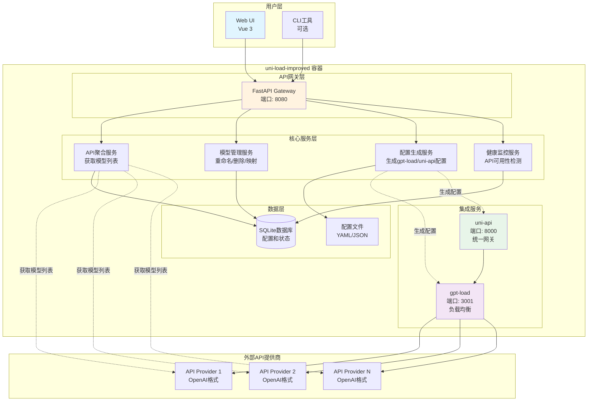
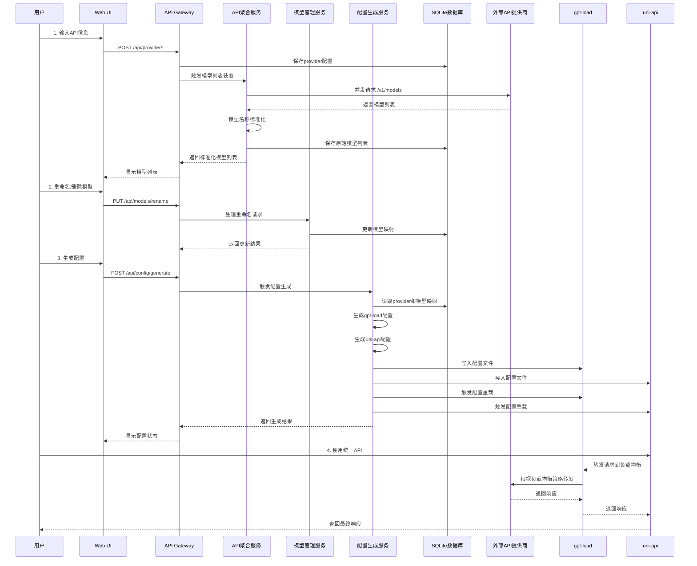
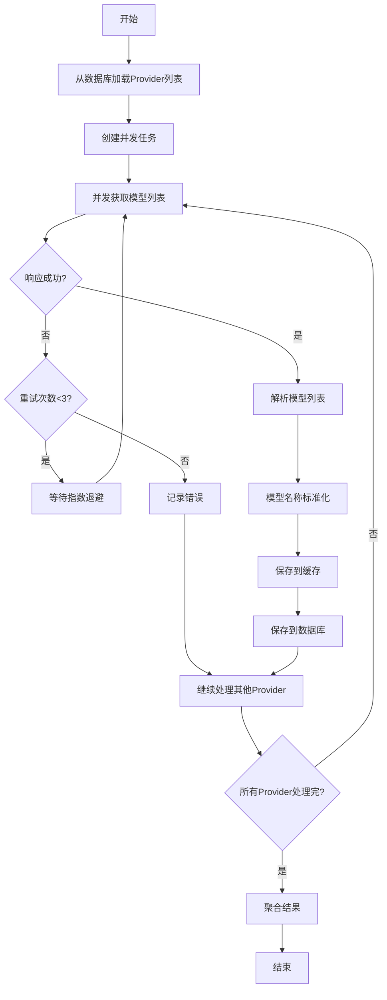

# uni-load-improved 架构设计文档

## 1. 项目概述

### 1.1 项目目标
uni-load-improved 是一个整合型的LLM大模型API网关系统，旨在将分散在不同API网站的模型服务整合成统一、高效的负载均衡系统。

### 1.2 核心改进点
1. **模型重命名可配置化**：用户可自定义model name mapping，不再硬编码
2. **模型删除功能**：用户可删除不需要的模型
3. **集成gpt-load**：使用gpt-load的模型重定向功能，避免重复造轮子
4. **Web UI管理**：提供友好的Web界面进行配置管理

### 1.3 技术栈选型

#### 后端技术栈
- **语言**: Python 3.11+
- **Web框架**: FastAPI（高性能、异步支持、自动API文档）
- **异步HTTP客户端**: httpx（支持HTTP/2、连接池）
- **数据验证**: Pydantic（类型安全、数据验证）
- **配置管理**: PyYAML、python-dotenv
- **任务调度**: APScheduler（定时刷新模型列表）
- **日志**: structlog（结构化日志）

#### 前端技术栈
- **框架**: Vue 3 + TypeScript
- **UI组件库**: Element Plus
- **状态管理**: Pinia
- **HTTP客户端**: Axios
- **构建工具**: Vite
- **代码规范**: ESLint + Prettier

#### 数据存储
- **配置存储**: SQLite（轻量级、无需额外服务）
- **缓存**: 内存缓存（模型列表、状态信息）
- **文件存储**: YAML/JSON（生成的配置文件）

#### 容器化
- **基础镜像**: python:3.11-slim
- **多架构支持**: amd64、arm64
- **编排工具**: Docker Compose

---

## 2. 系统架构设计

### 2.1 整体架构图



### 2.2 组件职责划分

#### 2.2.1 API网关层（FastAPI Gateway）
- 提供RESTful API接口
- 处理用户请求和响应
- 身份验证和授权（可选）
- 请求日志记录
- CORS处理

#### 2.2.2 API聚合服务（API Aggregator）
- 从多个API提供商获取模型列表
- 模型名称标准化（normalization）
- 错误处理和重试机制
- 并发请求优化
- 缓存模型列表

#### 2.2.3 模型管理服务（Model Manager）
- 管理provider-model映射关系
- 处理模型重命名操作
- 处理模型删除操作
- 同名模型的provider拆分（SiteA → SiteA-0, SiteA-1, SiteA-2）
- 模型分组管理

#### 2.2.4 配置生成服务（Config Generator）
- 生成gpt-load配置文件
  - 普通分组配置
  - 聚合分组配置
  - 模型重定向配置
- 生成uni-api配置文件
  - provider配置
  - model映射配置
- 配置验证和测试
- 配置热重载触发

#### 2.2.5 健康监控服务（Health Monitor）
- 定期检测API提供商可用性
- 记录响应时间和错误率
- 自动禁用不可用的provider
- 告警通知（可选）

### 2.3 数据流向图



### 2.4 与gpt-load、uni-api的集成方式

#### 2.4.1 All-in-One部署模式（默认）
- uni-load-improved、gpt-load、uni-api运行在同一容器
- 通过本地文件系统共享配置文件
- 使用localhost进行服务间通信
- 统一的健康检查和日志管理

#### 2.4.2 外部服务模式（可选）
- uni-load-improved通过HTTP API与外部gpt-load/uni-api通信
- 支持配置远程服务地址
- 通过API推送配置更新
- 需要配置认证凭据

---

## 3. 核心模块设计

### 3.1 API聚合模块

#### 3.1.1 模型列表获取流程



#### 3.1.2 模型名称标准化规则

```python
# 标准化规则示例
NORMALIZATION_RULES = {
    # 移除版本后缀
    r'-\d{8}$': '',  # gpt-4-20240101 -> gpt-4
    r'-preview$': '',  # gpt-4-turbo-preview -> gpt-4-turbo
    
    # 统一命名格式
    r'^gpt-?(\d+\.?\d*)': r'gpt-\1',  # gpt4 -> gpt-4
    r'^claude-?(\d+)': r'claude-\1',  # claude3 -> claude-3
    
    # 移除特殊字符
    r'[^\w\-\.]': '-',  # 非字母数字下划线点号替换为横线
    
    # 转小写
    'lowercase': True
}
```

#### 3.1.3 错误处理和重试机制

```python
# 重试配置
RETRY_CONFIG = {
    'max_retries': 3,
    'backoff_factor': 2,  # 指数退避因子
    'timeout': 30,  # 请求超时（秒）
    'retry_on_status': [429, 500, 502, 503, 504],  # 需要重试的HTTP状态码
}

# 错误分类
ERROR_TYPES = {
    'network_error': '网络连接错误',
    'timeout_error': '请求超时',
    'auth_error': '认证失败',
    'rate_limit_error': '速率限制',
    'server_error': '服务器错误',
    'parse_error': '响应解析错误',
}
```

### 3.2 模型管理模块

#### 3.2.1 数据结构设计

```python
from typing import List, Dict, Optional
from pydantic import BaseModel, Field
from datetime import datetime

class Provider(BaseModel):
    """API提供商"""
    id: str = Field(..., description="唯一标识符")
    name: str = Field(..., description="显示名称")
    base_url: str = Field(..., description="API基础URL")
    api_key: str = Field(..., description="API密钥")
    enabled: bool = Field(default=True, description="是否启用")
    priority: int = Field(default=0, description="优先级")
    created_at: datetime = Field(default_factory=datetime.now)
    updated_at: datetime = Field(default_factory=datetime.now)
    
    class Config:
        json_schema_extra = {
            "example": {
                "id": "openai-main",
                "name": "OpenAI Main",
                "base_url": "https://api.openai.com/v1",
                "api_key": "sk-xxx",
                "enabled": True,
                "priority": 10
            }
        }

class Model(BaseModel):
    """模型信息"""
    id: str = Field(..., description="模型ID")
    original_name: str = Field(..., description="原始模型名称")
    normalized_name: str = Field(..., description="标准化后的名称")
    display_name: Optional[str] = Field(None, description="用户自定义显示名称")
    provider_id: str = Field(..., description="所属Provider ID")
    enabled: bool = Field(default=True, description="是否启用")
    created_at: datetime = Field(default_factory=datetime.now)
    updated_at: datetime = Field(default_factory=datetime.now)
    
    class Config:
        json_schema_extra = {
            "example": {
                "id": "model-001",
                "original_name": "gpt-4-0125-preview",
                "normalized_name": "gpt-4",
                "display_name": "GPT-4 Turbo",
                "provider_id": "openai-main",
                "enabled": True
            }
        }

class ModelMapping(BaseModel):
    """模型映射关系"""
    unified_name: str = Field(..., description="统一模型名称")
    providers: List[str] = Field(..., description="Provider ID列表")
    load_balance_strategy: str = Field(default="round_robin", description="负载均衡策略")
    
    class Config:
        json_schema_extra = {
            "example": {
                "unified_name": "gpt-4",
                "providers": ["openai-main-0", "openai-backup-0"],
                "load_balance_strategy": "smart_round_robin"
            }
        }

class ProviderSplit(BaseModel):
    """Provider拆分信息"""
    original_provider_id: str
    split_providers: List[Dict[str, str]]  # [{"id": "provider-0", "model": "gpt-4"}, ...]
    
    class Config:
        json_schema_extra = {
            "example": {
                "original_provider_id": "openai-main",
                "split_providers": [
                    {"id": "openai-main-0", "model": "gpt-4"},
                    {"id": "openai-main-1", "model": "gpt-3.5-turbo"},
                    {"id": "openai-main-2", "model": "text-embedding-ada-002"}
                ]
            }
        }
```

#### 3.2.2 模型重命名逻辑

```python
class ModelRenameService:
    """模型重命名服务"""
    
    async def rename_model(
        self,
        model_id: str,
        new_display_name: str
    ) -> Model:
        """
        重命名模型
        
        Args:
            model_id: 模型ID
            new_display_name: 新的显示名称
            
        Returns:
            更新后的模型对象
        """
        # 1. 验证模型存在
        model = await self.db.get_model(model_id)
        if not model:
            raise ModelNotFoundError(f"Model {model_id} not found")
        
        # 2. 验证新名称不与其他模型冲突
        existing = await self.db.get_model_by_display_name(new_display_name)
        if existing and existing.id != model_id:
            raise ModelNameConflictError(f"Display name {new_display_name} already exists")
        
        # 3. 更新模型显示名称
        model.display_name = new_display_name
        model.updated_at = datetime.now()
        
        # 4. 保存到数据库
        await self.db.update_model(model)
        
        # 5. 触发配置重新生成
        await self.config_generator.regenerate_configs()
        
        return model
    
    async def batch_rename_models(
        self,
        renames: List[Dict[str, str]]
    ) -> List[Model]:
        """
        批量重命名模型
        
        Args:
            renames: [{"model_id": "xxx", "new_name": "yyy"}, ...]
            
        Returns:
            更新后的模型列表
        """
        updated_models = []
        
        async with self.db.transaction():
            for rename in renames:
                model = await self.rename_model(
                    rename['model_id'],
                    rename['new_name']
                )
                updated_models.append(model)
        
        return updated_models
```

#### 3.2.3 模型删除逻辑

```python
class ModelDeleteService:
    """模型删除服务"""
    
    async def delete_model(self, model_id: str) -> bool:
        """
        删除模型（软删除）
        
        Args:
            model_id: 模型ID
            
        Returns:
            是否删除成功
        """
        # 1. 获取模型
        model = await self.db.get_model(model_id)
        if not model:
            raise ModelNotFoundError(f"Model {model_id} not found")
        
        # 2. 软删除（设置enabled=False）
        model.enabled = False
        model.updated_at = datetime.now()
        await self.db.update_model(model)
        
        # 3. 更新相关的模型映射
        await self._update_model_mappings(model_id)
        
        # 4. 触发配置重新生成
        await self.config_generator.regenerate_configs()
        
        return True
    
    async def _update_model_mappings(self, model_id: str):
        """更新模型映射，移除已删除的模型"""
        mappings = await self.db.get_mappings_by_model(model_id)
        
        for mapping in mappings:
            # 从provider列表中移除
            if model_id in mapping.providers:
                mapping.providers.remove(model_id)
            
            # 如果映射没有provider了，删除整个映射
            if not mapping.providers:
                await self.db.delete_mapping(mapping.unified_name)
            else:
                await self.db.update_mapping(mapping)
```

#### 3.2.4 同名模型的Provider拆分算法

```python
class ProviderSplitService:
    """Provider拆分服务"""
    
    async def split_providers_by_model(self) -> List[ProviderSplit]:
        """
        按模型拆分Provider
        
        当多个模型来自同一个Provider时，为每个模型创建独立的Provider实例
        例如: openai-main -> openai-main-0, openai-main-1, openai-main-2
        
        Returns:
            拆分结果列表
        """
        splits = []
        
        # 1. 获取所有启用的Provider
        providers = await self.db.get_enabled_providers()
        
        for provider in providers:
            # 2. 获取该Provider的所有启用模型
            models = await self.db.get_models_by_provider(provider.id, enabled_only=True)
            
            if len(models) <= 1:
                # 只有一个或没有模型，不需要拆分
                continue
            
            # 3. 为每个模型创建拆分的Provider
            split_providers = []
            for idx, model in enumerate(models):
                split_id = f"{provider.id}-{idx}"
                split_providers.append({
                    "id": split_id,
                    "model": model.display_name or model.normalized_name,
                    "original_model": model.original_name
                })
            
            splits.append(ProviderSplit(
                original_provider_id=provider.id,
                split_providers=split_providers
            ))
        
        return splits
    
    async def create_model_groups(self) -> Dict[str, List[str]]:
        """
        创建模型分组
        
        将相同normalized_name的模型分组，用于创建聚合分组
        
        Returns:
            {
                "gpt-4": ["openai-main-0", "openai-backup-0"],
                "gpt-3.5-turbo": ["openai-main-1", "azure-0"],
                ...
            }
        """
        groups = {}
        
        # 1. 获取所有启用的模型
        models = await self.db.get_enabled_models()
        
        # 2. 获取Provider拆分信息
        splits = await self.split_providers_by_model()
        split_map = self._create_split_map(splits)
        
        # 3. 按normalized_name分组
        for model in models:
            unified_name = model.display_name or model.normalized_name
            
            # 查找拆分后的Provider ID
            split_id = self._find_split_provider_id(
                model.provider_id,
                model.original_name,
                split_map
            )
            
            if unified_name not in groups:
                groups[unified_name] = []
            
            groups[unified_name].append(split_id)
        
        return groups
    
    def _create_split_map(self, splits: List[ProviderSplit]) -> Dict:
        """创建拆分映射表"""
        split_map = {}
        for split in splits:
            split_map[split.original_provider_id] = {
                sp['original_model']: sp['id']
                for sp in split.split_providers
            }
        return split_map
    
    def _find_split_provider_id(
        self,
        provider_id: str,
        model_name: str,
        split_map: Dict
    ) -> str:
        """查找拆分后的Provider ID"""
        if provider_id in split_map:
            return split_map[provider_id].get(model_name, provider_id)
        return provider_id
```

### 3.3 配置生成模块

#### 3.3.1 gpt-load配置生成

```python
class GPTLoadConfigGenerator:
    """gpt-load配置生成器"""
    
    async def generate_config(self) -> Dict:
        """
        生成gpt-load配置
        
        Returns:
            gpt-load配置字典
        """
        config = {
            "providers": await self._generate_providers(),
            "groups": await self._generate_groups(),
            "aggregate_groups": await self._generate_aggregate_groups(),
            "model_redirects": await self._generate_model_redirects()
        }
        
        return config
    
    async def _generate_providers(self) -> List[Dict]:
        """生成providers配置"""
        providers_config = []
        
        # 获取所有启用的Provider
        providers = await self.db.get_enabled_providers()
        
        # 获取拆分信息
        splits = await self.split_service.split_providers_by_model()
        
        for provider in providers:
            # 查找该Provider的拆分信息
            split = next((s for s in splits if s.original_provider_id == provider.id), None)
            
            if split:
                # 有拆分，为每个拆分创建provider配置
                for sp in split.split_providers:
                    providers_config.append({
                        "name": sp['id'],
                        "base_url": provider.base_url,
                        "api_key": provider.api_key,
                        "models": [sp['original_model']],
                        "enabled": True
                    })
            else:
                # 无拆分，直接使用原Provider
                models = await self.db.get_models_by_provider(provider.id, enabled_only=True)
                providers_config.append({
                    "name": provider.id,
                    "base_url": provider.base_url,
                    "api_key": provider.api_key,
                    "models": [m.original_name for m in models],
                    "enabled": True
                })
        
        return providers_config
    
    async def _generate_groups(self) -> List[Dict]:
        """生成普通分组配置"""
        groups_config = []
        
        # 获取所有拆分后的Provider
        splits = await self.split_service.split_providers_by_model()
        
        for split in splits:
            for sp in split.split_providers:
                groups_config.append({
                    "name": sp['id'],
                    "providers": [sp['id']],
                    "strategy": "fixed_priority"
                })
        
        return groups_config
    
    async def _generate_aggregate_groups(self) -> List[Dict]:
        """生成聚合分组配置"""
        aggregate_groups_config = []
        
        # 获取模型分组
        model_groups = await self.split_service.create_model_groups()
        
        for unified_name, provider_ids in model_groups.items():
            if len(provider_ids) > 1:
                # 只有多个Provider时才创建聚合分组
                aggregate_groups_config.append({
                    "name": f"agg-{unified_name}",
                    "groups": provider_ids,
                    "strategy": "smart_round_robin"
                })
        
        return aggregate_groups_config
    
    async def _generate_model_redirects(self) -> Dict[str, str]:
        """
        生成模型重定向配置
        
        Returns:
            {
                "gpt-4": "agg-gpt-4",  # 有多个Provider，重定向到聚合分组
                "claude-3": "claude-provider-0",  # 只有一个Provider，直接重定向
                ...
            }
        """
        redirects = {}
        
        # 获取模型分组
        model_groups = await self.split_service.create_model_groups()
        
        for unified_name, provider_ids in model_groups.items():
            if len(provider_ids) > 1:
                # 多个Provider，重定向到聚合分组
                redirects[unified_name] = f"agg-{unified_name}"
            else:
                # 单个Provider，直接重定向
                redirects[unified_name] = provider_ids[0]
        
        return redirects
    
    async def save_config(self, config: Dict, file_path: str):
        """保存配置到文件"""
        import yaml
        
        with open(file_path, 'w', encoding='utf-8') as f:
            yaml.dump(config, f, allow_unicode=True, default_flow_style=False)
```

#### 3.3.2 uni-api配置生成

```python
class UniAPIConfigGenerator:
    """uni-api配置生成器"""
    
    async def generate_config(self) -> Dict:
        """
        生成uni-api配置
        
        Returns:
            uni-api配置字典
        """
        config = {
            "providers": await self._generate_providers(),
            "api": await self._generate_api_config()
        }
        
        return config
    
    async def _generate_providers(self) -> List[Dict]:
        """生成providers配置"""
        providers_config = []
        
        # uni-api的provider指向gpt-load
        gpt_load_url = self.config.get('gpt_load_url', 'http://localhost:3001')
        
        # 获取所有统一模型名称
        model_groups = await self.split_service.create_model_groups()
        
        for unified_name in model_groups.keys():
            providers_config.append({
                "provider": unified_name,
                "base_url": f"{gpt_load_url}/proxy/{unified_name}",
                "api": "openai",
                "models": [unified_name]
            })
        
        return providers_config
    
    async def _generate_api_config(self) -> Dict:
        """生成API配置"""
        return {
            "port": 8000,
            "bind": "0.0.0.0",
            "workers": 4,
            "log_level": "info"
        }
    
    async def save_config(self, config: Dict, file_path: str):
        """保存配置到文件"""
        import yaml
        
        with open(file_path, 'w', encoding='utf-8') as f:
            yaml.dump(config, f, allow_unicode=True, default_flow_style=False)
```

### 3.4 前端界面模块

#### 3.4.1 页面结构设计

```
uni-load-improved-ui/
├── src